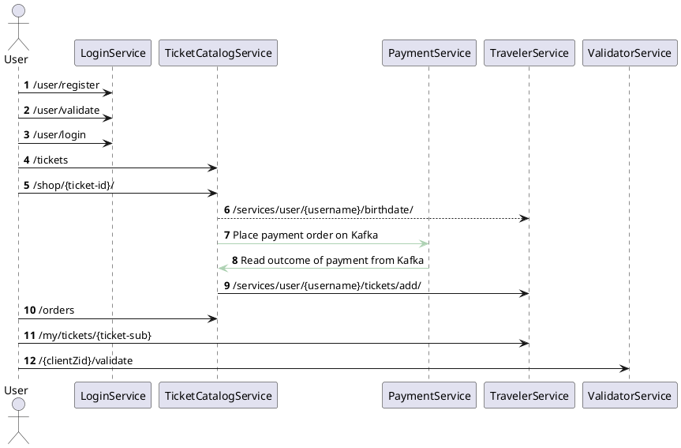
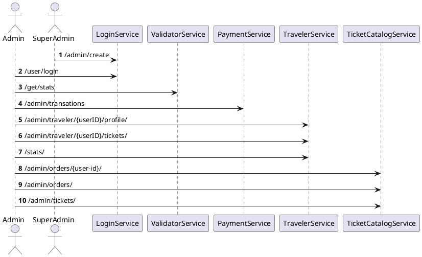

# Public-Transportation-Manager
This is a Web Applications II group project carried out during academic year 2021/22. It consists of a microservices system.

## Architecture

Developers singed in with github can find the architecture of the project from [diagrams.net (or draw.io)](https://app.diagrams.net/)

## Key management

## Flowchart of main user stories

### User actions

### Admin actions

## How to open this project

In order to open this project you need:
- Docker 
- JDK (version 16) - Prefer Amazon Corretto 16

## Steps

To run the project in a local environment it is needed to:
- Execute the docker-compose.yml file in the main directory (using `docker-compose up -d`). In this way all the needed containers (kafka, postgres) will be up and running.
- Postgres databases will be created using the env variable `POSTGRES_MULTIPLE_DATABASES` that is used by the script `pg-init-scripts` for the initialization and creation of the databases
  
## Checks

### Tests

Try to execute tests inside each module

### API HTTP requests

Try to use the http requests that you can find in each module
